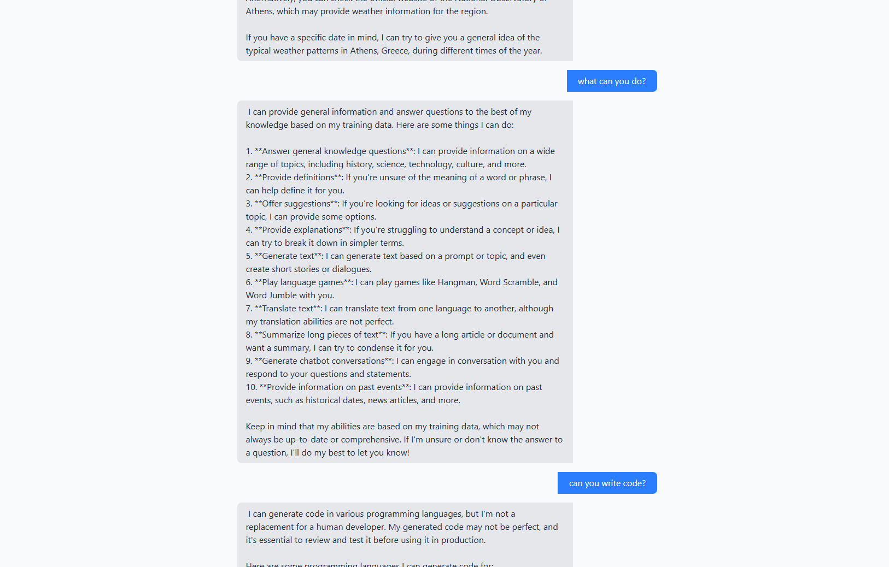
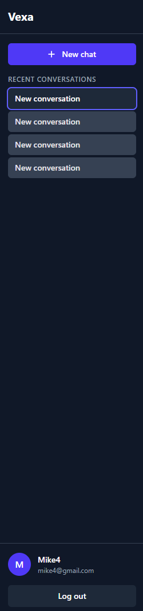
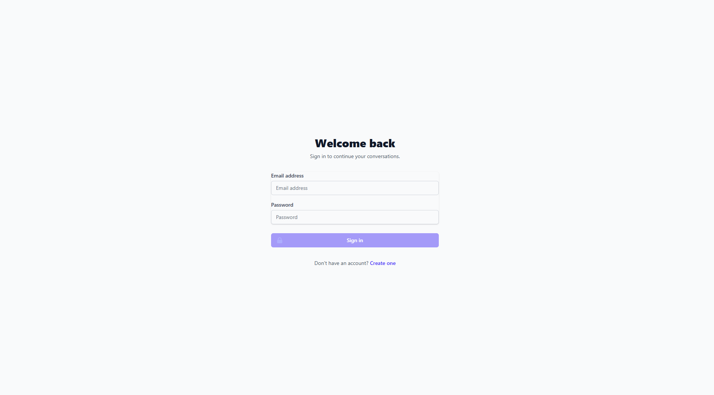
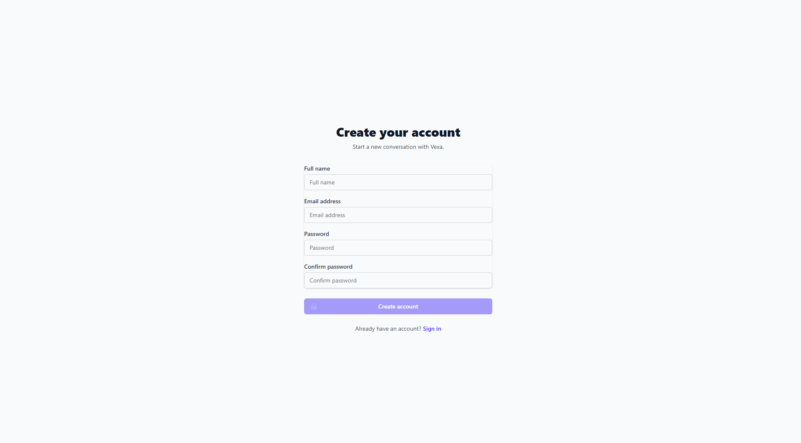
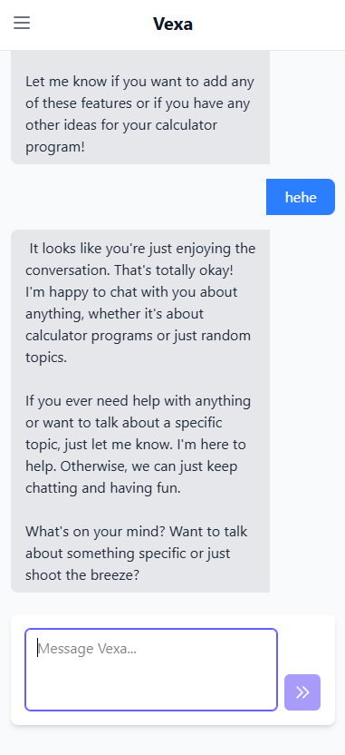

# Vexa

Vexa is a local-development full-stack AI chat application with authentication, persisted conversations and messages, and Groq-powered assistant replies. It is not production-ready.

## Preview

### AI conversation



### Dashboard



### Authentication





### Responsive navigation



## Tech Stack

- **Frontend**: Angular 22 with TypeScript
- **Backend**: Laravel 13 (PHP 8.3)
- **Database**: MySQL for application persistence, SQLite in-memory for automated tests
- **AI Provider**: Groq API with LLaMA 3.1 8B model
- **Styling**: Tailwind CSS

## Features

- 🔐 User Authentication (Registration & Login)
- 💬 Persistent Conversations
- 🤖 AI-Powered Responses via Groq
- 📱 Responsive Design
- 🔄 Real-time Messaging Interface

## Prerequisites

- PHP 8.3+
- Node.js 18+
- Composer
- npm

## Installation

### Backend Setup

```bash
cd backend
composer install
cp .env.example .env
php artisan key:generate
php artisan migrate
```

### Frontend Setup

```bash
cd frontend
npm install
```

## Configuration

### Environment Variables

Create a `.env` file in the `backend` directory with the following variables:

```env
APP_NAME=Vexa
APP_ENV=local
APP_KEY=
APP_DEBUG=true
APP_URL=http://localhost:8000

DB_CONNECTION=mysql
DB_HOST=127.0.0.1
DB_PORT=3306
DB_DATABASE=vexa
DB_USERNAME=root
DB_PASSWORD=

AI_PROVIDER=groq
GROQ_API_KEY=your_groq_api_key_here
GROQ_MODEL=llama-3.1-8b-instant
```

### AI Provider Setup

1. Sign up for a [Groq API key](https://console.groq.com)
2. Add your API key to the `.env` file

## Running the Application

### Start Backend Server

```bash
cd backend
php artisan serve
```

The backend will be available at http://localhost:8000

### Start Frontend Development Server

```bash
cd frontend
npm start
```

The frontend will be available at http://localhost:4200

## Usage

1. Register a new account or login with existing credentials
2. Create a new conversation using the "New Chat" button
3. Type your message in the input field and press Enter or click Send
4. Wait for the AI response to appear in the chat

## Project Structure

```
├── backend/                 # Laravel backend
│   ├── app/                 # Core application code
│   │   ├── Http/            # Controllers and middleware
│   │   ├── Models/          # Eloquent models
│   │   └── Services/        # Business logic and AI integration
│   ├── database/            # Migrations and seeds
│   ├── routes/              # API routes
│   └── tests/               # PHPUnit and Pest tests
└── frontend/                # Angular frontend
    ├── src/
    │   ├── app/             # Components and services
    │   ├── assets/          # Static assets
    │   └── environments/    # Environment configurations
    └── tailwind.config.js   # Tailwind CSS configuration
```

## API Endpoints

| Method | Endpoint                        | Description                    |
|--------|---------------------------------|--------------------------------|
| POST   | `/api/register`                 | User registration              |
| POST   | `/api/login`                    | User login                     |
| POST   | `/api/logout`                   | User logout                    |
| GET    | `/api/user`                     | Get authenticated user         |
| GET    | `/api/conversations`            | List user's conversations      |
| POST   | `/api/conversations`            | Create new conversation        |
| GET    | `/api/conversations/{id}`       | Get conversation details       |
| PUT    | `/api/conversations/{id}`       | Update conversation            |
| DELETE | `/api/conversations/{id}`       | Delete conversation            |
| GET    | `/api/conversations/{id}/messages` | List conversation messages |
| POST   | `/api/conversations/{id}/messages` | Create new message          |
| POST   | `/api/conversations/{id}/ai-reply` | Generate AI response         |

## Contributing

1. Fork the repository
2. Create your feature branch (`git checkout -b feature/AmazingFeature`)
3. Commit your changes (`git commit -m 'Add some amazing feature'`)
4. Push to the branch (`git push origin feature/AmazingFeature`)
5. Open a pull request

## License

No license has been selected yet.

## Acknowledgments

- [Groq](https://groq.com) for providing the fast inference API
- [LLaMA 3.1](https://ai.meta.com/blog/meta-llama-3-1/) for the open-source models
- [Laravel](https://laravel.com) for the elegant PHP framework
- [Angular](https://angular.io) for the powerful frontend framework